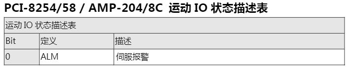

## Function Read_Info  
### Read_Para_Category  
- Category:  
position  
motion_status  
motion_io  

--- 

### Read_Para_Name  
- - position:
- 1. command   
double, 命令位置，以脈衝為單位。      
- 2. feedback  
double, 反饋位置，以脈衝為單位。    
- 3. target  
double, 在線性定位模式​​下，該值為目標位置。在圓形定位模式下，該值與命令位置相同。在速度和點動模式下，該值與命令位置相同。    
- 4. error   
double, 命令位置减去反馈位置。   
- 5. command_velocity   
double, 獲取64位命令速度提高。最小值取決於系統的速度計算精度。   
- 6. feedback_velocity   
double, 獲取64位反饋速度。最小值取決於系統的速度計算分辨率。   

- - motion_status:   
- 1. CSTP   
- 2. VM   
- 3. ACC   
- 4. DEC  
- 5. DIR  
- 6. MDN  
- 7. HMV  
- 8. WAIT  
- 9. PTB  
- 10. JOG  
- 11. ASTP  
- 12. BLD  
- 13. PRED  
- 14. POSTD  
- 15. GER  
- 16. BACKLASH  
- 17. Stop_Code  
  
  
  
- - motion_io:  
- 1. ALM  
- 2. PEL  
- 3. MEL  
- 4. ORG  
- 5. EMG  
- 6. EZ  
- 7. INP  
- 8. SVON  
- 9. SCL  
- 10. SPEL  
- 11. SMEL  
  
  